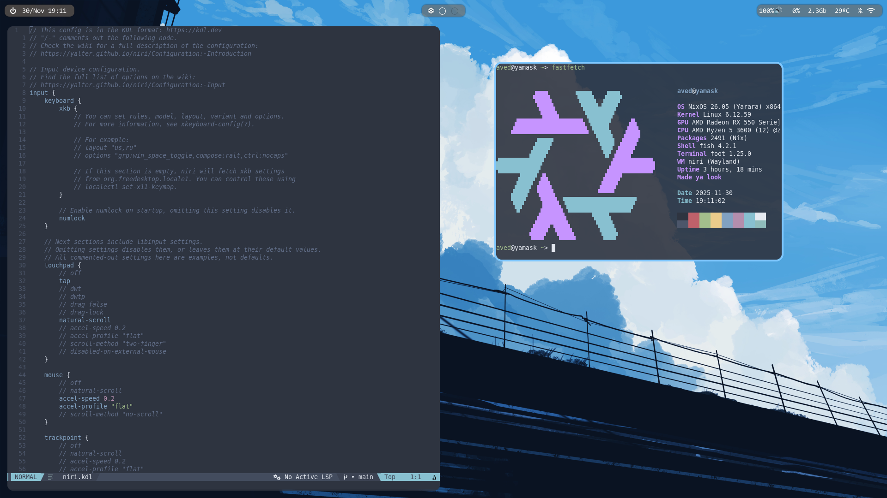
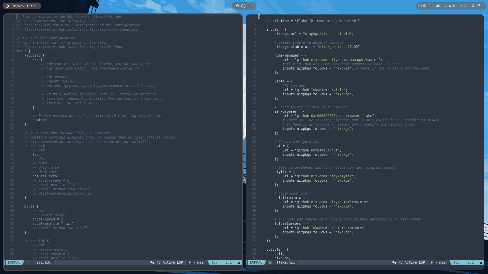
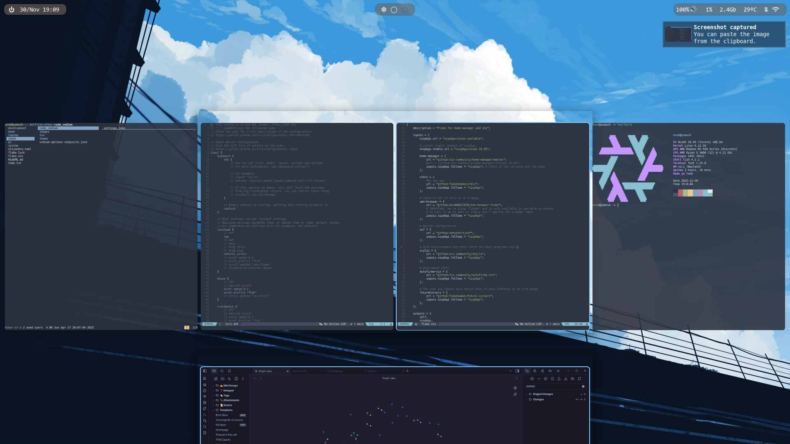

# My nixos dotfiles

It includes a laptop, pc and server configuration. Only difference is laptop doesn't have steam, discord etc and ofcourse the server does not have a GUI

Currently niri is enabled but can be changed for gnome or hyprland (not customized)

The pc host specifically comes with a specialisation for gnome, meaning for every rebuild you will get an extra one but instead of niri it will have gnome enabled







# Setup

## Nix flake
If you have flakes already enabled in your system you can run:
```nix
nix run github.com/Tukankamon/.dotfiles <HOSTNAME> <RepoName>

# Without flakes in configuration.nix, this enables them temporarily
nix run --extra-experimental-features "flakes nix-command" github.com/Tukankamon/.dotfiles <HOSTNAME> <RepoName>
```
Both options are optional and they default to "yamask" (that being the pc config) and .dotfiles respectively

Set the HOSTNAME parameter to either yamask or dwebble, "yamask" is the pc host while "dwebble" is the laptop one. The hostname for the server is "ekko"

RepoName is optional and is the name of your cloned repo and therefore the folder on your system, it is used when running git clone https://github.com/Tukankamon/.dotfiles.git <RepoName>

## Manual install
If not, you can always curl the script
```bash
bash <(curl -S https://raw.githubusercontent.com/Tukankamon/.dotfiles/main/setup.sh) <HOSTNAME> <RepoName>
```

## hardware-configuration.nix
If you have cloned the repo locally you can do the following only after having copied /etc/nixos/hardware-configuration.nix into either .dotfiles/pc or .dotfiles/laptop

Failure to do so will most likely crash your system (the script does it automatically)

Finally you can:
```bash
sudo nixos-rebuild switch --flake .#<HOSTNAME>
```

# Post setup considerations
You must set the user password with the passwd command

There is an explanation for this in pc/configuration.nix or laptop/configuration.nix in the user configuration

# Home configuration
Some dots (notably neovim) are configured directly with symlinks using [dotter](https://github.com/SuperCuber/dotter) in the [home](./home) folder alongiside what remains of the home manager config

To deploy these you need to install dotter (comes in the system configuration) and run dotter deploy from the home folder
